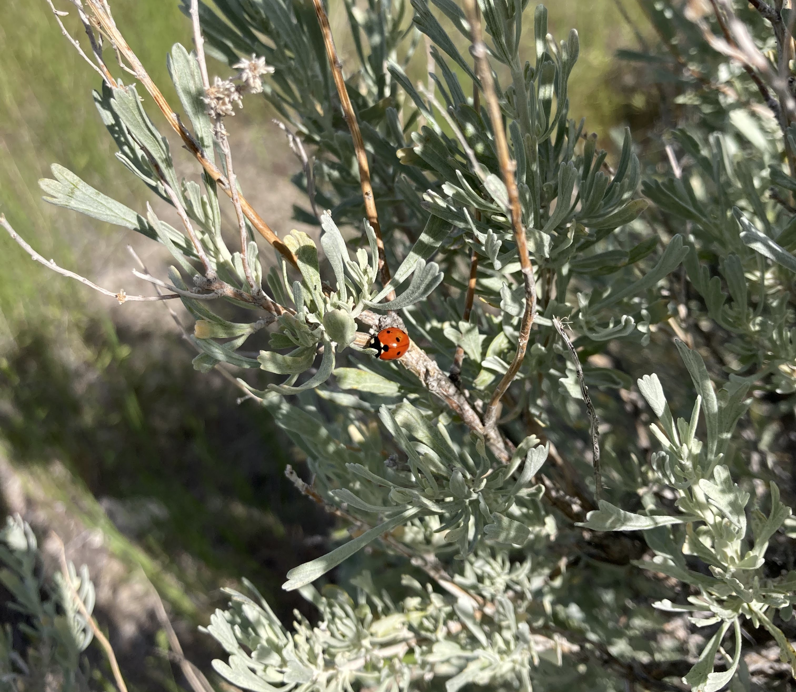

```{r, include=FALSE}
knitr::opts_chunk$set(
  results='asis', 
  echo = FALSE
)
library(tidyverse)
library(glue)
library(fontawesome)

# Set this to true to have links turned into footnotes at the end of the document
PDF_EXPORT <- FALSE

# Holds all the links that were inserted for placement at the end
links <- c()

source('parsing_functions.R') # Functions for building sections from CSV data
#source('common_variables.R')  # Small variables for non-csv data such as intro text
intro_text <- "My name is Carlos and I am a graduate student at Boise State University, slated to graduate Summer term 2023.
I grew up in Boise, ID and am passionate about innovation in research as well as academic pursuits mainly in biological sciences.
My Master's thesis investigates phenotypes and genomics of native sagebrush populations,
utilizing modern sequencing and computing technologies to answer complex questions about adaptive capacity, local adaptation,
and consequences of climate change on ecosystems.
When free, I volunteer as a musician and enjoy rock climbing and volleyball."

# First let's get the data, filtering to only the items tagged as
# Resume items
position_data <- read_csv('positions.csv') %>% 
  filter(in_resume) %>% 
  mutate(
    # Build some custom sections by collapsing others
    section = case_when(
      section %in% c('research_positions', 'industry_positions') ~ 'positions', 
      section %in% c('data_science_writings', 'by_me_press') ~ 'writings',
      TRUE ~ section
    )
  ) 

```


Aside
================================================================================


{width=100%}

Contact {#contact}
--------------------------------------------------------------------------------


- <i class="fa fa-envelope"></i> cdcduma@gmail.com
- <i class="fa fa-phone"></i> 410 800 7401
- **ORCiD** 0000-0003-0411-7129


Selected Skills {#skills}
--------------------------------------------------------------------------------

- <i class="fa fa-laptop"></i> Versed in R, Bash, Linux/Unix Operating Systems, Microsoft Office Suite, Adobe Creative Suite

- <i class="fa fa-gear"></i> Trained in DNA extraction, sterile technique, de novo assembly, genome mapping and annotation, database curation, biostatistics

- <i class="fa fa-comment-dots"></i> Fluent in English, Tagalog (Filipino), Conversant in Spanish


Disclaimer {#disclaimer}
--------------------------------------------------------------------------------

Made w/ [**pagedown**](https://github.com/rstudio/pagedown). 

Source code: [github.com/davecarlos/CV](https://github.com/davecarlos/CV).

Last updated on `r Sys.Date()`.


Main
================================================================================

Carlos Dave Dumaguit {#title}
--------------------------------------------------------------------------------

```{r}
cat(sanitize_links(intro_text))
```


Education {data-icon=graduation-cap data-concise=true}
--------------------------------------------------------------------------------

```{r}
position_data %>% print_section('education')
```


Selected Positions {data-icon=suitcase}
--------------------------------------------------------------------------------

```{r}
position_data %>% print_section('positions')
```


Publications {data-icon=newspaper}
--------------------------------------------------------------------------------


```{r}
position_data %>% print_section('writings')
```


Presentations {data-icon=bookmark}
--------------------------------------------------------------------------------


```{r}
position_data %>% print_section('presentations')
```


Teaching Positions {data-icon=chalkboard}
--------------------------------------------------------------------------------


```{r}
position_data %>% print_section('teaching_positions')
```


Awards & Scholarships {data-icon=award}
--------------------------------------------------------------------------------


```{r}
position_data %>% print_section('awards')
```


Other Professional Experiences {data-icon=briefcase}
--------------------------------------------------------------------------------


```{r}
position_data %>% print_section('professions')
```


